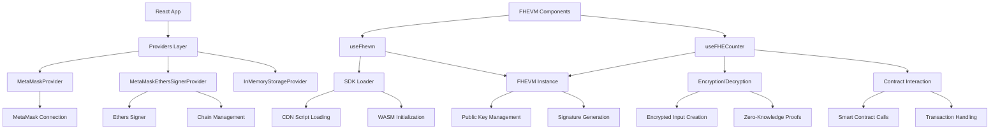

# FHEVM 前端集成完整指南

## 概述

本指南基于实际项目实现，详细介绍了如何在前端应用中集成FHEVM（Fully Homomorphic Encryption Virtual Machine），实现从SDK加载、实例管理、数据加密/解密到智能合约交互的完整流程。

## 目录

1. [项目架构概述](#1-项目架构概述)
2. [SDK加载与初始化](#2-sdk加载与初始化)
3. [FHEVM实例管理](#3-fhevm实例管理)
4. [数据加密实现](#4-数据加密实现)
5. [数据解密实现](#6-数据解密实现)
6. [智能合约交互](#5-智能合约交互)
7. [存储和密钥管理](#7-存储和密钥管理)
8. [React集成最佳实践](#8-react集成最佳实践)
9. [错误处理和调试](#9-错误处理和调试)
10. [性能优化](#10-性能优化)

---

## 1. 项目架构概述

### 技术栈

```json
{
  "frontend": "Next.js 15 + React 19 + TypeScript",
  "blockchain": "FHEVM v0.8 + Solidity 0.8.24",
  "sdk": "@zama-fhe/relayer-sdk v0.2.0",
  "storage": "IndexedDB + In-Memory Storage",
  "wallet": "MetaMask + ethers.js v6"
}
```

### 核心文件结构

```
frontend/
├── fhevm/                          # FHEVM核心模块
│   ├── useFhevm.tsx               # FHEVM实例管理Hook
│   ├── fhevmTypes.ts              # 类型定义
│   ├── FhevmDecryptionSignature.ts # 解密签名管理
│   ├── GenericStringStorage.ts    # 存储接口
│   └── internal/                   # 内部实现
│       ├── fhevm.ts               # FHEVM实例创建
│       ├── RelayerSDKLoader.ts    # SDK加载器
│       ├── PublicKeyStorage.ts    # 密钥存储
│       └── constants.ts           # 常量配置
├── hooks/                         # 业务逻辑Hooks
│   ├── useFHECounter.tsx          # 计数器业务逻辑
│   ├── metamask/                  # MetaMask集成
│   └── useInMemoryStorage.tsx     # 内存存储Hook
└── components/                     # UI组件
    └── FHECounterDemo.tsx         # 主演示组件
```

### 依赖关系图



---

## 2. SDK加载与初始化

### 2.1 CDN配置

```typescript
// frontend/fhevm/internal/constants.ts
export const SDK_CDN_URL =
  "https://cdn.zama.ai/relayer-sdk-js/0.2.0/relayer-sdk-js.umd.cjs";
```

### 2.2 SDK加载器实现

```typescript
// frontend/fhevm/internal/RelayerSDKLoader.ts
export class RelayerSDKLoader {
  private _trace?: TraceType;

  constructor(options: { trace?: TraceType }) {
    this._trace = options.trace;
  }

  public load(): Promise<void> {
    return new Promise((resolve, reject) => {
      // 检查是否已存在
      if ("relayerSDK" in window) {
        if (!isFhevmRelayerSDKType(window.relayerSDK, this._trace)) {
          reject(new Error("SDK对象无效"));
          return;
        }
        resolve();
        return;
      }

      // 动态创建script标签
      const script = document.createElement("script");
      script.src = SDK_CDN_URL;
      script.type = "text/javascript";
      script.async = true;

      script.onload = () => {
        if (!isFhevmWindowType(window, this._trace)) {
          reject(new Error("window.relayerSDK对象无效"));
          return;
        }
        resolve();
      };

      script.onerror = () => {
        reject(new Error(`Failed to load Relayer SDK from ${SDK_CDN_URL}`));
      };

      document.head.appendChild(script);
    });
  }
}
```

### 2.3 SDK初始化

```typescript
// frontend/fhevm/internal/fhevm.ts
const fhevmLoadSDK: FhevmLoadSDKType = () => {
  const loader = new RelayerSDKLoader({ trace: console.log });
  return loader.load();
};

const fhevmInitSDK: FhevmInitSDKType = async (options?: FhevmInitSDKOptions) => {
  if (!isFhevmWindowType(window, console.log)) {
    throw new Error("window.relayerSDK is not available");
  }

  const result = await window.relayerSDK.initSDK(options);
  window.relayerSDK.__initialized__ = result;

  if (!result) {
    throw new Error("window.relayerSDK.initSDK failed.");
  }

  return true;
};
```

---

## 3. FHEVM实例管理

### 3.1 useFhevm Hook

```typescript
// frontend/fhevm/useFhevm.tsx
export type FhevmGoState = "idle" | "loading" | "ready" | "error";

export function useFhevm(parameters: {
  provider: string | ethers.Eip1193Provider | undefined;
  chainId: number | undefined;
  enabled?: boolean;
  initialMockChains?: Readonly<Record<number, string>>;
}): {
  instance: FhevmInstance | undefined;
  refresh: () => void;
  error: Error | undefined;
  status: FhevmGoState;
} {
  const { provider, chainId, enabled = true, initialMockChains } = parameters;

  const [instance, _setInstance] = useState<FhevmInstance | undefined>(undefined);
  const [status, _setStatus] = useState<FhevmGoState>("idle");
  const [error, _setError] = useState<Error | undefined>(undefined);

  // 并发控制
  const _abortControllerRef = useRef<AbortController | null>(null);
  const _providerRef = useRef<string | ethers.Eip1193Provider | undefined>(provider);
  const _chainIdRef = useRef<number | undefined>(chainId);

  const refresh = useCallback(() => {
    // 取消之前的操作
    if (_abortControllerRef.current) {
      _abortControllerRef.current.abort();
      _abortControllerRef.current = null;
    }

    // 重置状态
    _providerRef.current = provider;
    _chainIdRef.current = chainId;
    _setInstance(undefined);
    _setError(undefined);
    _setStatus("idle");

    if (provider !== undefined) {
      _setProviderChanged((prev) => prev + 1);
    }
  }, [provider, chainId]);

  // 主初始化逻辑
  useEffect(() => {
    if (!_isRunning || !_providerRef.current) return;

    const runInitialization = async () => {
      try {
        _setStatus("loading");
        _setError(undefined);

        const newInstance = await createFhevmInstance({
          signal: _abortControllerRef.current!.signal,
          provider: _providerRef.current!,
          mockChains: _mockChainsRef.current,
          onStatusChange: (s) => console.log(`[useFhevm] status: ${s}`),
        });

        if (_abortControllerRef.current!.signal.aborted) return;

        _setInstance(newInstance);
        _setError(undefined);
        _setStatus("ready");

      } catch (e) {
        if (_abortControllerRef.current!.signal.aborted) return;

        _setInstance(undefined);
        _setError(e as Error);
        _setStatus("error");
      }
    };

    runInitialization();
  }, [_isRunning, _providerChanged]);

  return { instance, refresh, error, status };
}
```

### 3.2 FHEVM实例创建

```typescript
// frontend/fhevm/internal/fhevm.ts
export const createFhevmInstance = async (parameters: {
  provider: Eip1193Provider | string;
  mockChains?: Record<number, string>;
  signal: AbortSignal;
  onStatusChange?: (status: FhevmRelayerStatusType) => void;
}): Promise<FhevmInstance> => {

  const throwIfAborted = () => {
    if (signal.aborted) throw new FhevmAbortError();
  };

  const { provider: providerOrUrl, mockChains, signal, onStatusChange } = parameters;

  // 1. 解析链ID和RPC URL
  const { isMock, rpcUrl, chainId } = await resolve(providerOrUrl, mockChains);

  // 2. 处理Mock环境（开发环境）
  if (isMock) {
    const fhevmRelayerMetadata = await tryFetchFHEVMHardhatNodeRelayerMetadata(rpcUrl);
    if (fhevmRelayerMetadata) {
      const fhevmMock = await import("./mock/fhevmMock");
      const mockInstance = await fhevmMock.fhevmMockCreateInstance({
        rpcUrl,
        chainId,
        metadata: fhevmRelayerMetadata,
      });
      throwIfAborted();
      return mockInstance;
    }
  }

  // 3. 生产环境处理
  if (!isFhevmWindowType(window, console.log)) {
    await fhevmLoadSDK();
    throwIfAborted();
  }

  if (!isFhevmInitialized()) {
    await fhevmInitSDK();
    throwIfAborted();
  }

  // 4. 获取存储的公钥
  const relayerSDK = (window as FhevmWindowType).relayerSDK;
  const aclAddress = relayerSDK.SepoliaConfig.aclContractAddress;
  const pub = await publicKeyStorageGet(aclAddress);
  throwIfAborted();

  // 5. 创建实例配置
  const config: FhevmInstanceConfig = {
    ...relayerSDK.SepoliaConfig,
    network: providerOrUrl,
    publicKey: pub.publicKey,
    publicParams: pub.publicParams,
  };

  // 6. 创建并返回实例
  const instance = await relayerSDK.createInstance(config);

  // 7. 保存公钥（异步，不阻塞）
  await publicKeyStorageSet(
    aclAddress,
    instance.getPublicKey(),
    instance.getPublicParams(2048)
  );

  throwIfAborted();
  return instance;
};
```

---

## 4. 数据加密实现

### 4.1 加密输入创建

```typescript
// 加密输入创建示例
const createEncryptedInput = async (
  instance: FhevmInstance,
  contractAddress: string,
  userAddress: string,
  values: any[]
) => {
  // 1. 创建加密输入缓冲区
  const buffer = instance.createEncryptedInput(
    contractAddress,  // 允许交互的合约地址
    userAddress       // 允许导入密文的实体地址
  );

  // 2. 添加不同类型的值
  values.forEach(value => {
    if (typeof value === 'number') {
      buffer.add32(BigInt(value));  // 32位整数
    } else if (typeof value === 'boolean') {
      buffer.addBool(value);        // 布尔值
    } else if (typeof value === 'string' && value.startsWith('0x')) {
      buffer.addAddress(value);     // 地址
    }
  });

  // 3. 执行加密 (CPU密集型操作)
  const ciphertexts = await buffer.encrypt();

  return {
    handles: ciphertexts.handles,      // 密文句柄数组
    inputProof: ciphertexts.inputProof  // 零知识证明
  };
};
```

### 4.2 完整加密流程

```typescript
// useFHECounter.tsx 中的实际加密实现
const incOrDec = useCallback(async (value: number) => {
  if (isRefreshingRef.current || isIncOrDecRef.current) return;

  if (!fheCounter.address || !instance || !ethersSigner) return;

  const thisChainId = chainId;
  const thisFheCounterAddress = fheCounter.address;
  const thisEthersSigner = ethersSigner;

  isIncOrDecRef.current = true;
  setIsIncOrDec(true);
  setMessage(`Start ${value > 0 ? 'increment' : 'decrement'}...`);

  const run = async () => {
    // 检查操作是否被取消
    const isStale = () =>
      thisFheCounterAddress !== fheCounterRef.current?.address ||
      !sameChain.current(thisChainId) ||
      !sameSigner.current(thisEthersSigner);

    try {
      if (isStale()) {
        setMessage(`Ignore ${value > 0 ? 'increment' : 'decrement'}`);
        return;
      }

      setMessage(`Call ${value > 0 ? 'increment' : 'decrement'}...`);

      // 1. 创建加密输入缓冲区
      const input = instance.createEncryptedInput(
        thisFheCounterAddress,
        thisEthersSigner.address
      );

      // 2. 添加要加密的值
      input.add32(Math.abs(value));

      // 3. 执行加密 (CPU密集型操作，可能需要延迟执行)
      await new Promise(resolve => setTimeout(resolve, 100));
      const enc = await input.encrypt();

      if (isStale()) return;

      // 4. 创建合约实例
      const thisFheCounterContract = new ethers.Contract(
        thisFheCounterAddress,
        fheCounter.abi,
        thisEthersSigner
      );

      // 5. 调用智能合约
      const tx = value > 0
        ? await thisFheCounterContract.increment(enc.handles[0], enc.inputProof)
        : await thisFheCounterContract.decrement(enc.handles[0], enc.inputProof);

      setMessage(`Wait for tx:${tx.hash}...`);

      // 6. 等待交易确认
      const receipt = await tx.wait();

      setMessage(`Call ${value > 0 ? 'increment' : 'decrement'} completed status=${receipt?.status}`);

      if (isStale()) return;

      // 7. 刷新计数器状态
      refreshCountHandle();

    } catch (error) {
      setMessage(`${value > 0 ? 'Increment' : 'Decrement'} Failed! ${error.message}`);
    } finally {
      isIncOrDecRef.current = false;
      setIsIncOrDec(false);
    }
  };

  run();
}, [
  ethersSigner,
  fheCounter.address,
  fheCounter.abi,
  instance,
  chainId,
  refreshCountHandle,
  sameChain,
  sameSigner,
]);
```

---

## 5. 数据解密实现

### 5.1 解密签名管理

```typescript
// frontend/fhevm/FhevmDecryptionSignature.ts
export class FhevmDecryptionSignature {
  publicKey: string;
  privateKey: string;
  signature: string;
  startTimestamp: number;
  durationDays: number;
  userAddress: `0x${string}`;
  contractAddresses: `0x${string}`[];
  eip712: EIP712Type;

  constructor(parameters: FhevmDecryptionSignatureType) {
    // 构造函数实现
  }

  // 签名验证
  isValid(): boolean {
    return Date.now() / 1000 < this.#startTimestamp + this.#durationDays * 24 * 60 * 60;
  }

  // 从存储加载签名
  static async loadFromGenericStringStorage(
    storage: GenericStringStorage,
    instance: FhevmInstance,
    contractAddresses: string[],
    userAddress: string,
    publicKey?: string
  ): Promise<FhevmDecryptionSignature | null> {
    try {
      const storageKey = new FhevmDecryptionSignatureStorageKey(
        instance,
        contractAddresses,
        userAddress,
        publicKey
      );

      const result = await storage.getItem(storageKey.key);
      if (!result) return null;

      const kps = FhevmDecryptionSignature.fromJSON(result);
      return kps.isValid() ? kps : null;

    } catch {
      return null;
    }
  }

  // 创建新签名
  static async new(
    instance: FhevmInstance,
    contractAddresses: string[],
    publicKey: string,
    privateKey: string,
    signer: ethers.Signer
  ): Promise<FhevmDecryptionSignature | null> {
    try {
      const userAddress = await signer.getAddress() as `0x${string}`;
      const startTimestamp = Math.floor(Date.now() / 1000);
      const durationDays = 365;

      // 创建EIP712签名数据
      const eip712 = instance.createEIP712(
        publicKey,
        contractAddresses,
        startTimestamp,
        durationDays
      );

      // 签名
      const signature = await signer.signTypedData(
        eip712.domain,
        { UserDecryptRequestVerification: eip712.types.UserDecryptRequestVerification },
        eip712.message
      );

      return new FhevmDecryptionSignature({
        publicKey,
        privateKey,
        contractAddresses: contractAddresses as `0x${string}`[],
        startTimestamp,
        durationDays,
        signature,
        eip712: eip712 as EIP712Type,
        userAddress,
      });

    } catch {
      return null;
    }
  }

  // 加载或创建签名
  static async loadOrSign(
    instance: FhevmInstance,
    contractAddresses: string[],
    signer: ethers.Signer,
    storage: GenericStringStorage,
    keyPair?: { publicKey: string; privateKey: string }
  ): Promise<FhevmDecryptionSignature | null> {
    const userAddress = await signer.getAddress() as `0x${string}`;

    // 尝试从缓存加载
    const cached = await FhevmDecryptionSignature.loadFromGenericStringStorage(
      storage,
      instance,
      contractAddresses,
      userAddress,
      keyPair?.publicKey
    );

    if (cached) return cached;

    // 创建新签名
    const { publicKey, privateKey } = keyPair ?? instance.generateKeypair();
    const sig = await FhevmDecryptionSignature.new(
      instance,
      contractAddresses,
      publicKey,
      privateKey,
      signer
    );

    if (!sig) return null;

    // 保存到存储
    await sig.saveToGenericStringStorage(storage, instance, Boolean(keyPair?.publicKey));

    return sig;
  }
}
```

### 5.2 用户解密流程

```typescript
// frontend/hooks/useFHECounter.tsx 中的解密实现
const decryptCountHandle = useCallback(() => {
  if (isRefreshingRef.current || isDecryptingRef.current) return;

  if (!fheCounter.address || !instance || !ethersSigner) return;

  // 防止重复解密
  if (countHandle === clearCountRef.current?.handle) return;

  if (!countHandle) {
    setClearCount(undefined);
    clearCountRef.current = undefined;
    return;
  }

  // 跳过零值处理
  if (countHandle === ethers.ZeroHash) {
    setClearCount({ handle: countHandle, clear: BigInt(0) });
    clearCountRef.current = { handle: countHandle, clear: BigInt(0) };
    return;
  }

  const thisChainId = chainId;
  const thisFheCounterAddress = fheCounter.address;
  const thisCountHandle = countHandle;
  const thisEthersSigner = ethersSigner;

  isDecryptingRef.current = true;
  setIsDecrypting(true);
  setMessage("Start decrypt");

  const run = async () => {
    // 检查操作是否过期
    const isStale = () =>
      thisFheCounterAddress !== fheCounterRef.current?.address ||
      !sameChain.current(thisChainId) ||
      !sameSigner.current(thisEthersSigner);

    try {
      // 1. 构建解密签名
      const sig = await FhevmDecryptionSignature.loadOrSign(
        instance,
        [fheCounter.address as `0x${string}`],
        ethersSigner,
        fhevmDecryptionSignatureStorage
      );

      if (!sig) {
        setMessage("Unable to build FHEVM decryption signature");
        return;
      }

      if (isStale()) {
        setMessage("Ignore FHEVM decryption");
        return;
      }

      setMessage("Call FHEVM userDecrypt...");

      // 2. 执行解密
      const res = await instance.userDecrypt(
        [{ handle: thisCountHandle, contractAddress: thisFheCounterAddress }],
        sig.privateKey,
        sig.publicKey,
        sig.signature,
        sig.contractAddresses,
        sig.userAddress,
        sig.startTimestamp,
        sig.durationDays
      );

      setMessage("FHEVM userDecrypt completed!");

      if (isStale()) {
        setMessage("Ignore FHEVM decryption");
        return;
      }

      // 3. 保存解密结果
      setClearCount({ handle: thisCountHandle, clear: res[thisCountHandle] });
      clearCountRef.current = {
        handle: thisCountHandle,
        clear: res[thisCountHandle],
      };

      setMessage(`Count handle clear value is ${clearCountRef.current.clear}`);

    } catch (error) {
      console.error('解密失败:', error);
      setMessage("Decryption failed");
    } finally {
      isDecryptingRef.current = false;
      setIsDecrypting(false);
    }
  };

  run();
}, [
  fhevmDecryptionSignatureStorage,
  ethersSigner,
  fheCounter.address,
  instance,
  countHandle,
  chainId,
  sameChain,
  sameSigner,
]);
```

### 5.3 公共解密

```typescript
// 适用于公开数据的解密
const decryptPublicData = async (
  instance: FhevmInstance,
  contractAddress: string,
  encryptedHandle: string
) => {
  try {
    const decryptedValue = await instance.decryptPublic(
      contractAddress,
      encryptedHandle
    );
    return decryptedValue;
  } catch (error) {
    console.error('Public decryption failed:', error);
    throw error;
  }
};
```

---

## 6. 智能合约交互

### 6.1 合约地址管理

```typescript
// frontend/hooks/useFHECounter.tsx
function getFHECounterByChainId(chainId: number | undefined): FHECounterInfoType {
  if (!chainId) {
    return { abi: FHECounterABI.abi };
  }

  // 从生成的地址映射中查找
  const entry = FHECounterAddresses[chainId.toString() as keyof typeof FHECounterAddresses];

  if (!("address" in entry) || entry.address === ethers.ZeroAddress) {
    return { abi: FHECounterABI.abi, chainId };
  }

  return {
    address: entry?.address as `0x${string}` | undefined,
    chainId: entry?.chainId ?? chainId,
    chainName: entry?.chainName,
    abi: FHECounterABI.abi,
  };
}
```

### 6.2 合约调用

```typescript
// 读取操作
const refreshCountHandle = useCallback(() => {
  if (isRefreshingRef.current) return;

  if (!fheCounterRef.current?.address || !ethersReadonlyProvider) {
    setCountHandle(undefined);
    return;
  }

  isRefreshingRef.current = true;
  setIsRefreshing(true);

  const thisChainId = fheCounterRef.current.chainId;
  const thisFheCounterAddress = fheCounterRef.current.address;

  // 创建只读合约实例
  const thisFheCounterContract = new ethers.Contract(
    thisFheCounterAddress,
    fheCounterRef.current.abi,
    ethersReadonlyProvider
  );

  thisFheCounterContract
    .getCount()
    .then((value) => {
      // 检查操作是否仍然有效
      if (sameChain.current(thisChainId) &&
          thisFheCounterAddress === fheCounterRef.current?.address) {
        setCountHandle(value);
      }

      isRefreshingRef.current = false;
      setIsRefreshing(false);
    })
    .catch((e) => {
      setMessage("FHECounter.getCount() call failed! error=" + e);
      isRefreshingRef.current = false;
      setIsRefreshing(false);
    });
}, [ethersReadonlyProvider, sameChain]);
```

### 6.3 写操作（带签名）

```typescript
// 写操作需要签名者
const thisFheCounterContract = new ethers.Contract(
  thisFheCounterAddress,
  fheCounter.abi,
  thisEthersSigner  // 使用签名者而不是只读提供者
);

// 执行交易
const tx = await thisFheCounterContract.multiplyByTwo();

// 等待确认
const receipt = await tx.wait();
```

---

## 7. 存储和密钥管理

### 7.1 存储接口

```typescript
// frontend/fhevm/GenericStringStorage.ts
export interface GenericStringStorage {
  getItem(key: string): string | Promise<string | null> | null;
  setItem(key: string, value: string): void | Promise<void>;
  removeItem(key: string): void | Promise<void>;
}

// 内存存储实现
export class GenericStringInMemoryStorage implements GenericStringStorage {
  #store = new Map<string, string>();

  getItem(key: string): string | Promise<string | null> | null {
    return this.#store.has(key) ? this.#store.get(key)! : null;
  }

  setItem(key: string, value: string): void | Promise<void> {
    this.#store.set(key, value);
  }

  removeItem(key: string): void | Promise<void> {
    this.#store.delete(key);
  }
}
```

### 7.2 IndexedDB持久化存储

```typescript
// frontend/fhevm/internal/PublicKeyStorage.ts
interface PublicParamsDB extends DBSchema {
  publicKeyStore: {
    key: string;
    value: {
      acl: `0x${string}`;
      value: FhevmStoredPublicKey;
    };
  };
  paramsStore: {
    key: string;
    value: {
      acl: `0x${string}`;
      value: FhevmStoredPublicParams;
    };
  };
}

let __dbPromise: Promise<IDBPDatabase<PublicParamsDB>> | undefined = undefined;

async function _getDB(): Promise<IDBPDatabase<PublicParamsDB> | undefined> {
  if (__dbPromise) return __dbPromise;

  if (typeof window === "undefined") return undefined;

  __dbPromise = openDB<PublicParamsDB>("fhevm", 1, {
    upgrade(db) {
      if (!db.objectStoreNames.contains("paramsStore")) {
        db.createObjectStore("paramsStore", { keyPath: "acl" });
      }
      if (!db.objectStoreNames.contains("publicKeyStore")) {
        db.createObjectStore("publicKeyStore", { keyPath: "acl" });
      }
    },
  });

  return __dbPromise;
}

export async function publicKeyStorageGet(aclAddress: `0x${string}`): Promise<{
  publicKey?: FhevmInstanceConfigPublicKey;
  publicParams: FhevmInstanceConfigPublicParams | null;
}> {
  const db = await _getDB();
  if (!db) return { publicParams: null };

  // 从IndexedDB获取公钥和参数
  const storedPublicKey = await db.get("publicKeyStore", aclAddress);
  const storedPublicParams = await db.get("paramsStore", aclAddress);

  // 构建返回对象
  const publicKey = storedPublicKey?.value?.publicKeyId && storedPublicKey?.value?.publicKey
    ? {
        id: storedPublicKey.value.publicKeyId,
        data: storedPublicKey.value.publicKey,
      }
    : undefined;

  const publicParams = storedPublicParams?.value
    ? { "2048": storedPublicParams.value }
    : null;

  return { publicKey, publicParams };
}

export async function publicKeyStorageSet(
  aclAddress: `0x${string}`,
  publicKey: FhevmStoredPublicKey | null,
  publicParams: FhevmStoredPublicParams | null
) {
  const db = await _getDB();
  if (!db) return;

  if (publicKey) {
    await db.put("publicKeyStore", { acl: aclAddress, value: publicKey });
  }

  if (publicParams) {
    await db.put("paramsStore", { acl: aclAddress, value: publicParams });
  }
}
```

---

## 8. React集成最佳实践

### 8.1 Provider层级结构

```typescript
// frontend/app/providers.tsx
export function Providers({ children }: Props) {
  return (
    <MetaMaskProvider>                    {/* MetaMask钱包连接 */}
      <MetaMaskEthersSignerProvider       {/* Ethers签名者提供者 */}
        initialMockChains={{ 31337: "http://localhost:8545" }}
      >
        <InMemoryStorageProvider>         {/* 内存存储提供者 */}
          {children}
        </InMemoryStorageProvider>
      </MetaMaskEthersSignerProvider>
    </MetaMaskProvider>
  );
}
```

### 8.2 内存存储Hook

```typescript
// frontend/hooks/useInMemoryStorage.tsx
interface UseInMemoryStorageState {
  storage: GenericStringStorage;
}

const InMemoryStorageContext = createContext<UseInMemoryStorageState | undefined>(undefined);

export const useInMemoryStorage = () => {
  const context = useContext(InMemoryStorageContext);
  if (!context) {
    throw new Error("useInMemoryStorage must be used within a InMemoryStorageProvider");
  }
  return context;
};

export const InMemoryStorageProvider: React.FC<InMemoryStorageProviderProps> = ({ children }) => {
  const [storage] = useState<GenericStringStorage>(new GenericStringInMemoryStorage());

  return (
    <InMemoryStorageContext.Provider value={{ storage }}>
      {children}
    </InMemoryStorageContext.Provider>
  );
};
```

### 8.3 主组件集成

```typescript
// frontend/components/FHECounterDemo.tsx
export const FHECounterDemo = () => {
  // 获取存储
  const { storage: fhevmDecryptionSignatureStorage } = useInMemoryStorage();

  // 获取MetaMask状态
  const {
    provider,
    chainId,
    accounts,
    isConnected,
    ethersSigner,
    ethersReadonlyProvider,
    sameChain,
    sameSigner,
  } = useMetaMaskEthersSigner();

  // 初始化FHEVM实例
  const { instance: fhevmInstance, status: fhevmStatus, error: fhevmError } = useFhevm({
    provider,
    chainId,
    initialMockChains: { 31337: "http://localhost:8545" },
    enabled: true,
  });

  // 初始化业务逻辑
  const fheCounter = useFHECounter({
    instance: fhevmInstance,
    fhevmDecryptionSignatureStorage,
    eip1193Provider: provider,
    chainId,
    ethersSigner,
    ethersReadonlyProvider,
    sameChain,
    sameSigner,
  });

  // UI渲染
  if (!isConnected) {
    return (
      <button onClick={connect} disabled={isConnected}>
        <span className="text-4xl p-6">Connect to MetaMask</span>
      </button>
    );
  }

  return (
    <div className="grid w-full gap-4">
      {/* 状态显示面板 */}
      <div className="col-span-full mx-20 bg-black text-white">
        <p className="font-semibold text-3xl m-5">
          FHEVM React Minimal Template -{" "}
          <span className="font-mono font-normal text-gray-400">FHECounter.sol</span>
        </p>
      </div>

      {/* 控制按钮 */}
      <div className="grid grid-cols-3 mx-20 gap-4">
        <button
          className={buttonClass}
          disabled={!fheCounter.canIncOrDec}
          onClick={() => fheCounter.incOrDec(+1)}
        >
          {fheCounter.canIncOrDec ? "Increment Counter by 1" : "Cannot increment"}
        </button>

        <button
          className={buttonClass}
          disabled={!fheCounter.canIncOrDec}
          onClick={() => fheCounter.incOrDec(-1)}
        >
          {fheCounter.canIncOrDec ? "Decrement Counter by 1" : "Cannot decrement"}
        </button>

        <button
          className={buttonClass}
          disabled={!fheCounter.canMultiplyByTwo}
          onClick={fheCounter.multiplyByTwo}
        >
          {fheCounter.canMultiplyByTwo ? "Multiply Counter by 2" : "Cannot multiply by 2"}
        </button>
      </div>

      {/* 解密按钮 */}
      <button
        className={buttonClass}
        disabled={!fheCounter.canDecrypt}
        onClick={fheCounter.decryptCountHandle}
      >
        {fheCounter.canDecrypt ? "Decrypt" : "Nothing to decrypt"}
      </button>

      {/* 状态消息 */}
      <div className="col-span-full mx-20 p-4 rounded-lg bg-white border-2 border-black">
        {printProperty("Message", fheCounter.message)}
      </div>
    </div>
  );
};
```

---

## 9. 错误处理和调试

### 9.1 错误类型

```typescript
// frontend/fhevm/internal/fhevm.ts
export class FhevmReactError extends Error {
  code: string;
  constructor(code: string, message?: string, options?: ErrorOptions) {
    super(message, options);
    this.code = code;
    this.name = "FhevmReactError";
  }
}

export class FhevmAbortError extends Error {
  constructor(message = "FHEVM operation was cancelled") {
    super(message);
    this.name = "FhevmAbortError";
  }
}
```

### 9.2 错误处理策略

```typescript
// 统一的错误处理函数
const handleFhevmError = (error: unknown) => {
  if (error instanceof FhevmAbortError) {
    console.log("Operation was cancelled");
    return;
  }

  if (error instanceof FhevmReactError) {
    switch (error.code) {
      case "WEB3_CLIENTVERSION_ERROR":
        alert("网络节点不可用，请检查RPC端点");
        break;
      case "FHEVM_RELAYER_METADATA_ERROR":
        alert("FHEVM节点不可用，请检查配置");
        break;
      default:
        alert(`FHEVM错误: ${error.message}`);
    }
    return;
  }

  // 通用错误处理
  console.error("Unexpected error:", error);
  alert("操作失败，请重试");
};
```

### 9.3 调试技巧

```typescript
// 启用详细日志
const DEBUG = process.env.NODE_ENV === 'development';

const debugLog = (message: string, ...args: any[]) => {
  if (DEBUG) {
    console.log(`[FHEVM] ${message}`, ...args);
  }
};

// 在关键操作点添加调试信息
const createFhevmInstance = async (params) => {
  debugLog("Creating FHEVM instance", params);

  try {
    // ... 创建逻辑
    debugLog("FHEVM instance created successfully");
    return instance;
  } catch (error) {
    debugLog("FHEVM instance creation failed", error);
    throw error;
  }
};
```

---

## 10. 性能优化

### 10.1 延迟执行CPU密集型操作

```typescript
// 加密操作前添加延迟，避免UI冻结
const run = async () => {
  // CPU密集型操作前延迟
  await new Promise(resolve => setTimeout(resolve, 100));

  // 执行加密
  const enc = await input.encrypt();
};
```

### 10.2 并发控制

```typescript
// 使用ref防止并发操作
const isRefreshingRef = useRef<boolean>(false);

const refreshCountHandle = useCallback(() => {
  if (isRefreshingRef.current) {
    debugLog("Refresh already in progress, skipping");
    return;
  }

  isRefreshingRef.current = true;
  // ... 执行刷新逻辑

  isRefreshingRef.current = false;
}, []);
```

### 10.3 结果缓存

```typescript
// 缓存解密结果
const clearCountRef = useRef<ClearValueType>(undefined);

const decryptCountHandle = useCallback(() => {
  // 检查是否已解密
  if (countHandle === clearCountRef.current?.handle) {
    debugLog("Already decrypted, skipping");
    return;
  }

  // ... 执行解密逻辑
  clearCountRef.current = { handle: countHandle, clear: result };
}, [countHandle]);
```

### 10.4 批量操作优化

```typescript
// 批量加密多个值
const batchEncrypt = async (values: any[]) => {
  const buffer = instance.createEncryptedInput(contractAddress, userAddress);

  values.forEach(value => {
    if (typeof value === 'number') {
      buffer.add32(BigInt(value));
    }
  });

  // 一次性加密所有值
  const ciphertexts = await buffer.encrypt();

  return ciphertexts.handles; // 返回所有密文句柄
};
```

### 10.5 内存管理

```typescript
// 清理不需要的密文句柄
const cleanupHandles = (handles: string[]) => {
  // 在组件卸载时清理
  return () => {
    handles.forEach(handle => {
      // 如果SDK提供清理方法，调用它
      if (instance?.cleanupHandle) {
        instance.cleanupHandle(handle);
      }
    });
  };
};

// 在useEffect中使用
useEffect(() => {
  return cleanupHandles(activeHandles);
}, [activeHandles]);
```

---

## 总结

本指南提供了一个完整的FHEVM前端集成解决方案，包括：

### ✅ 核心功能
- **SDK动态加载**: 从CDN动态加载FHEVM Relayer SDK
- **实例管理**: 完整的FHEVM实例生命周期管理
- **数据加密**: 支持多种数据类型的加密操作
- **数据解密**: 用户解密和公共解密支持
- **合约交互**: 完整的智能合约调用流程
- **存储管理**: 内存存储和IndexedDB持久化

### ✅ 架构优势
- **模块化设计**: 每个功能模块独立，可复用
- **类型安全**: 完整的TypeScript类型定义
- **错误处理**: 完善的错误处理和恢复机制
- **性能优化**: 并发控制、缓存、延迟执行等优化
- **开发友好**: 详细的日志和调试支持

### ✅ 实际应用
- **计数器Demo**: 完整的增减乘操作演示
- **状态管理**: React Hook状态管理最佳实践
- **UI集成**: 现代化的用户界面设计

这个实现可以作为开发FHEVM dApp的完整参考，涵盖了从基础设置到高级功能的所有方面。开发者可以根据具体需求在此基础上进行定制和扩展。
